# sovereign-ai-radar
*Analyzing global news around Sovereign AI starting 2025*

```👨🏼‍💻 Developed using Vibe coding```

An automated data pipeline that monitors, enriches, and visualizes global "Sovereign AI" investments. This system utilizes Google Gemini AI for deal extraction and a Python/Pandas enrichment layer for financial and geographic standardization.


---

## Table of Contents:

- [Key Features](#-key-features)
- [Process Flow](#-process-flow)
- [System Architecture](#-system-architecture)
- [Looker Studio Dashboard](#-looker-studio-deashboard)
- [Setup Instructions](#-setup-instructions)
- [Configuration](#-configuration)
  

## 🚀 Key Features
- **Intelligent Classification:** Uses `gemini-flash-latest` to distinguish between general AI news and actual sovereign/government investments.
- **Multi-Stage Deduplication:** * **Layer 1 (Apps Script):** Persistent SHA-256 Hashes for exact matches.
    - **Layer 2 (Python):** `RapidFuzz` fuzzy matching for "newsy duplicates" across different outlets within a 14-day window.
- **Dual Feed Support:** Native handling for both **RSS** (Google News) and **Atom** (Google Alerts) XML namespaces.
- **Batch Processing:** Optimizes performance and script runtime by batch-writing rows to the spreadsheet.
- **Reliability:** Implements exponential backoff and retries for Gemini API calls to handle transient network issues.
- **Financial Enrichment:** Automatically parses complex strings (e.g., "€50M") and converts them to **USD** using live FX rates.
- **Geographic Mapping:** Standardizes country names and maps them to **UN M49 Regions/Sub-Regions** for macro-trend analysis.
- **Executive Dashboarding:** Native Looker Studio integration for real-time visualization of spend and news volume.

## 🔄 Process Flow

The E2E pipeline operates across three primary environments:

1. **Ingestion (Apps Script):** Fetches XML from Google Alerts, normalizes URLs, and uses Gemini to extract raw structured data into the `daily_updates` tab.
2. **Enrichment (Python/Colab):** * Cleans headlines and canonicalizes URLs.
    - Enriches rows with standardized countries, currencies, and USD values.
    - Joins against regional mapping files to add UN geographic metadata.
3. **Deduplication & Quality Control (Python):** Clustered deduplication logic ranks duplicate entries by "data density" and marks a single "KEEP" candidate per group.
4. **Visualization (Looker Studio):** Consumes the `daily_enriched` tab, filtering for high-confidence records to populate strategic charts.

```mermaid
graph LR
    A["🌐 Data Sourcing"] --> B["🤖 AI Analysis"]
    B --> C["💎 Data Enrichment"]
    C --> D["🛡️ Quality Control"]
    D --> E["📊 Executive Radar"]
```



## 🏗️ System Architecture

## 📈 Looker Studio Dashboard
The final output is a dashboard that visualizes global sovereign AI trends.
- Analytics: KPI cards for Country Count, News Count, and Total Planned Spend.
- Geographic Distribution: Heatmaps and treemaps visualizing news volume by country.
- Latest Announcements: A filtered, searchable list of the latest validated news with direct source links.<br>
  


## 🛠️ Setup Instructions

### 1. Spreadsheet Preparation

Open your Google Sheet, go to **Extensions > Apps Script**, and paste the code. Run the `setupSheet()` function to initialize the headers.

### 2. API Key Configuration

This script requires a Gemini API Key.

1. Go to **Project Settings** (gear icon) in the Apps Script editor.
2. Under **Script Properties**, add a new property:
    - **Property:** `GEMINI_API_KEY`
    - **Value:** `[Your actual API Key from Google AI Studio]`

### 3. Python Enrichment
1. Install requirements: pip install gspread gspread_dataframe pandas pycountry country_converter rapidfuzz.
2. Run the enrichment script to process raw updates into daily_enriched.
3. Note: Ensure the country mapping tab (UN M49) exists in your sheet for regional mapping.

### 4. Automation (Triggers)

To keep the tracker updated automatically:

1. Click the **Triggers** (alarm clock icon) on the left sidebar.
2. Add a new trigger for the `updateDaily` function.
3. Set it to **Time-driven** > **Day timer** > (Select your preferred time).

## ⚙️ Configuration

The `CONFIG` object at the top of the script allows you to tune the behavior:

- `dailyMaxItems`: Limits the number of articles processed per day to manage API costs.
- `seenStoreLimit`: Controls how many article hashes are remembered (default 12,000).
- `sheetUrlScanLastN`: How many recent rows to check for URL duplicates (default 5,000).
- `day_window(14)`: Time window for fuzzy duplicate detection.
- `headline_high(95)`: Confidence threshold for automatic duplicate removal.
---
