# sovereign-ai-radar
*Analyzing global news around Sovereign AI starting 2025*

```👨🏼‍💻 Developed using Vibe coding```

An automated data pipeline that monitors, enriches, and visualizes global "Sovereign AI" investments. This system utilizes Google Gemini AI for deal extraction and a Python/Pandas enrichment layer for financial and geographic standardization.


1. [Key Features](#key-features)
2. [Process Flow](#process-flow)
3. [System Architecture](#system-architecture)
4.


## 🚀 Key Features
- **Intelligent Classification:** Uses `gemini-flash-latest` to distinguish between general AI news and actual sovereign/government investments.
- **Multi-Stage Deduplication:** * **Layer 1 (Apps Script):** Persistent SHA-256 Hashes for exact matches.
    - **Layer 2 (Python):** `RapidFuzz` fuzzy matching for "newsy duplicates" across different outlets within a 14-day window.
- **Dual Feed Support:** Native handling for both **RSS** (Google News) and **Atom** (Google Alerts) XML namespaces.
- **Batch Processing:** Optimizes performance and script runtime by batch-writing rows to the spreadsheet.
- **Reliability:** Implements exponential backoff and retries for Gemini API calls to handle transient network issues.
- **Financial Enrichment:** Automatically parses complex strings (e.g., "€50M") and converts them to **USD** using live FX rates.
- **Geographic Mapping:** Standardizes country names and maps them to **UN M49 Regions/Sub-Regions** for macro-trend analysis.
- **Executive Dashboarding:** Native Looker Studio integration for real-time visualization of spend and news volume.

## 🔄 Process Flow

The E2E pipeline operates across three primary environments:

1. **Ingestion (Apps Script):** Fetches XML from Google Alerts, normalizes URLs, and uses Gemini to extract raw structured data into the `daily_updates` tab.
2. **Enrichment (Python/Colab):** * Cleans headlines and canonicalizes URLs.
    - Enriches rows with standardized countries, currencies, and USD values.
    - Joins against regional mapping files to add UN geographic metadata.
3. **Deduplication & Quality Control (Python):** Clustered deduplication logic ranks duplicate entries by "data density" and marks a single "KEEP" candidate per group.
4. **Visualization (Looker Studio):** Consumes the `daily_enriched` tab, filtering for high-confidence records to populate strategic charts.

```mermaid
graph LR
    A["🌐 Data Sourcing"] --> B["🤖 AI Analysis"]
    B --> C["💎 Data Enrichment"]
    C --> D["🛡️ Quality Control"]
    D --> E["📊 Executive Radar"]
```



## 🏗️ System Architecture


